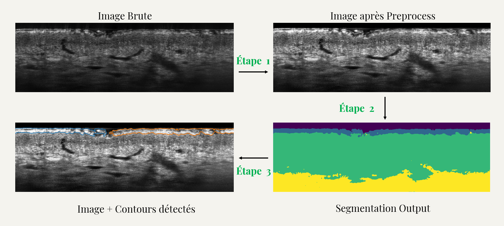
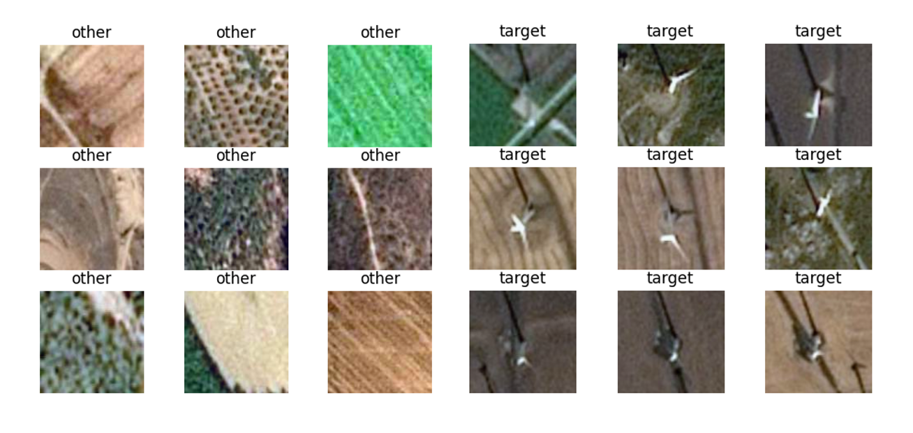

# Portfolio – Data Science & Image Processing

Bienvenue sur mon portfolio GitHub.  
Vous y trouverez une sélection de projets réalisés seul ou en collaboration dans les domaines de la **Data Science**, du **Machine Learning** et du **Traitement d’Images**.  
Ce portfolio illustre mon parcours, mes compétences, ainsi que mes axes d’amélioration futurs.

---

## Compétences mises en pratique
- Machine Learning : classification, clustering, réseaux de neurones (CNN, RNN)  
- Traitement d’images : segmentation, détection d’anomalies, transport optimal  
- Outils et langages : Python, R, SQL, NumPy, Pandas, PyTorch, Scikit-learn  
- Visualisation : Excel, Power BI, Tableau  

---

## Projets principaux

### [ND Project – Image Processing & Segmentation](https://github.com/Farius0/ND_Project-.git)
  
Développement d’un pipeline ND-ready pour le traitement, l’analyse et la segmentation d’images médicales LC-OCT, et plus largement d’images multidimensionnelles.  
- Compatibilité NumPy et PyTorch  
- Modules de détection, filtrage et mesure de caractéristiques  
- Application directe en analyse biomédicale  

### [Estimation et caractérisation du mouvement en imagerie médicale](https://github.com/Farius0/Analyse_Imagerie_Medicale.git)
  
Implémentation de méthodes classiques (Horn-Schunck, PCA) pour l’estimation du mouvement dans des séquences médicales.  
- Analyse vectorielle et régularisation  
- Visualisation des champs de mouvement  

### [Apprentissage de fonctions de régularisation convexes](https://github.com/radiama/projet-M2-image-.git)
  
Projet académique collaboratif en optimisation numérique.  
- Application à la résolution de problèmes inverses  
- Comparaisons entre modèles classiques et réseaux de neurones  

### [Modèles de Machine Learning (UB)](https://github.com/Farius0/Machine_Deep_Learning.git)
  
Exploration de différents modèles supervisés et non supervisés :  
- Réseaux de neurones  
- Régression linéaire et logistique  
- Méthodes de clustering (KMeans, PCA, etc.)  

---

## Projets académiques

- [Travaux pratiques en traitement d’images et signaux (UB)](https://github.com/Farius0/TPs_Image_Signal.git)  
- [Optimisation convexe et transport optimal (UB)](https://github.com/Farius0/Optimisations.git)  
- [Analyse de données FIFA 15–22](https://github.com/Farius0/FiFA-2015_2022.git)  
- [Mémoires de Licence et de Master (ENEAM)](https://github.com/Farius0/Memoires.git)  

---

## Formations et travaux associés

- [Formations en ligne – Python, SQL, Full Stack, Excel, Power BI](https://github.com/Farius0/Formation_Ligne.git)  
  *(contient des notebooks pratiques, des rapports BI et divers projets réalisés dans le cadre de cours en ligne)*

### Quelques exemples

- [Site Recette de gateau au chocolat](https://farius0.github.io/Formation_Ligne/)
    
- [Site Pizza Menu (via django)](https://fariusaina.pythonanywhere.com/)
  

---

## Documents
- [CV](docs/CV_FA.pdf)

---

## Contact
- Site Professionnel : [Lien](https://fariusaina.com)
- LinkedIn : [Farius Aina](https://linkedin.com/in/farius-a-716b69244)  
- Email : ainau***@gmail.com  
