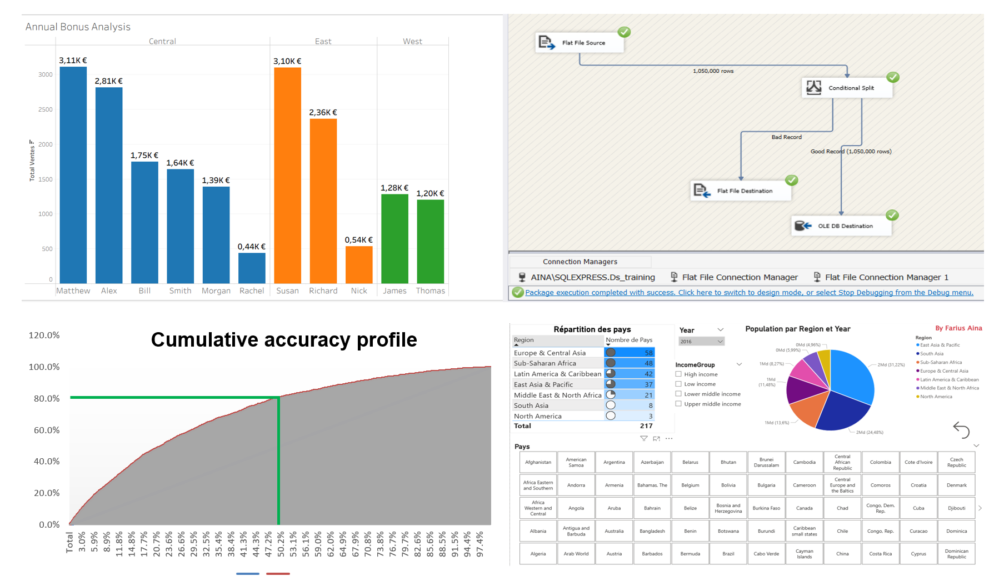

# Portfolio – Data Science & Image Processing

Welcome to my GitHub portfolio.

I am a Data Scientist with expertise in data analysis, machine learning, 
and image processing, applied to diverse domains including medical imaging, 
industrial data, and applied analytics.

This portfolio showcases a selection of academic, professional, and personal projects 
illustrating my technical skills, methodological rigor, and continuous learning process.

---

## Core Technical Skills

### Data Science & Machine Learning
- Supervised and unsupervised learning (regression, classification, clustering)
- Feature engineering and model evaluation
- Neural networks (CNNs, basic deep learning pipelines)

### Image Processing & Medical Imaging
- Image segmentation, denoising, artifact removal
- Multidimensional (2D / 3D / ND) image analysis
- Medical imaging applications (LC-OCT)

### Data Analysis & Visualization
- Data exploration and analysis with SQL and Python
- Dashboards and reporting: Power BI, Tableau
- Advanced Excel for data cleaning and analysis

### Programming & Tools
- Python, R, SQL, JavaScript
- NumPy, Pandas, PyTorch, Scikit-learn
- Git, VS Code, Jupyter, BigQuery

---

## Certifications & Professional Credentials

### Data Science & Analytics
- Google Data Analytics Professional Certificate
- Data Science & Machine Learning Specialization

### Cloud, BI & Data Platforms
- Microsoft Azure AZ-900 (Fundamentals)
- DP-100, PL-300 (in progress)

### Programming & Development
- Python Developer Certification
- SQL, Excel, Power BI Certifications
- Full Stack Development (HTML, CSS, JavaScript, React, TypeScript)

Verified credentials and official transcripts:
- Coursera: https://www.coursera.org/account/accomplishments/specialization/6VYEFQ18FBXP  
- Google Skills: https://www.skills.google/public_profiles/76dbfaca-d7cf-48d5-bc8e-22374b0538f6  
- Microsoft Learn: https://learn.microsoft.com/fr-fr/users/fariusaina-8780/transcript/dw2g1i62wmn5rn2  
- Credly: https://www.credly.com/users/farius-aina  

---

## Flagship Projects

### [ND Project – Image Processing & Segmentation](https://github.com/Farius0/ND_Project-.git)

Development of an ND-ready pipeline for processing, analysis, and segmentation of medical LC-OCT images and multidimensional data.
- NumPy and PyTorch compatibility
- Modular architecture for filtering, detection, and feature measurement
- Direct application to biomedical image analysis

### [Estimation and Characterization of Motion in Medical Imaging](https://github.com/Farius0/Analyse_Imagerie_Medicale.git)
   
Implementation of classical motion estimation techniques (Horn–Schunck, PCA) applied to medical image sequences.
- Vector field analysis and regularization
- Visualization of motion fields

### [Learning Convex Regularization Functions](https://github.com/radiama/projet-M2-image-.git)
 
Collaborative academic project in numerical optimization.
- Application to inverse problems
- Comparison between classical models and neural network-based approaches

### [Machine Learning Models (University Projects)](https://github.com/Farius0/Machine_Deep_Learning.git)
 

Exploration of supervised and unsupervised machine learning models:
- Neural networks
- Linear and logistic regression
- Clustering methods (KMeans, PCA)

---

## Academic & Applied Projects

- [Image and Signal Processing Practical Works (UB):](https://github.com/Farius0/TPs_Image_Signal.git)  
 
- [Convex Optimization & Optimal Transport (UB):](https://github.com/Farius0/Optimisations.git) 

- [FIFA Data Analysis (2015–2022):](https://github.com/Farius0/FiFA-2015_2022.git)

- [Bachelor’s and Master’s Theses (ENEAM):](https://github.com/Farius0/Memoires.git)  
 
---

## Continuous Learning & Training Projects

[Online training projects including notebooks, BI reports, and applied exercises:](https://github.com/Farius0/Formation_Ligne.git) 

Examples:
- [Recipe website (static web project):](https://farius0.github.io/Formation_Ligne/)
   

- [Pizza menu web application (Django):](https://fariusaina.pythonanywhere.com/)
  
 
---

## Documents
- [Curriculum Vitae](docs/CV_FA.pdf)

---

## Contact
- Professional website: [Link](https://fariusaina.com) 
- LinkedIn: [Farius Aina](https://linkedin.com/in/farius-a-716b69244)
- Email: ainau***@gmail.com  
