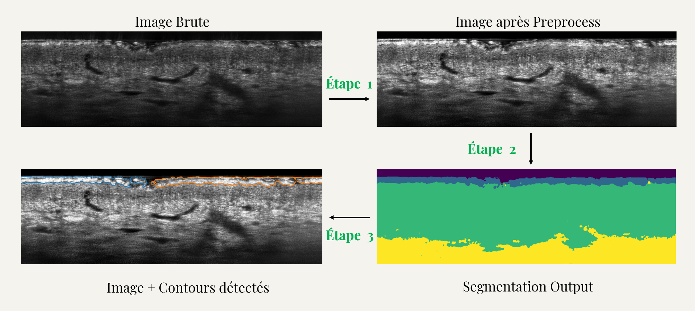
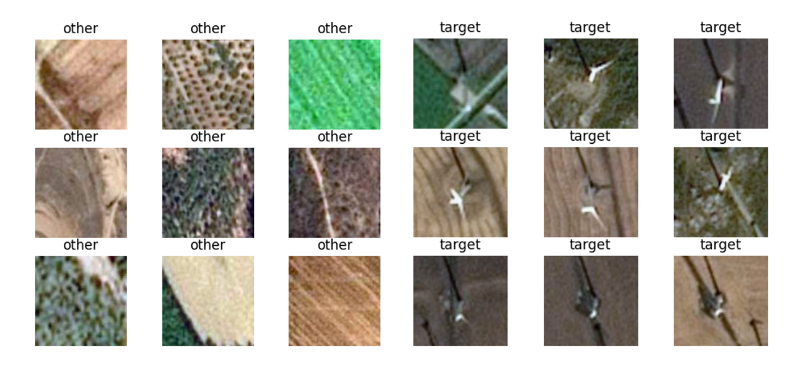

# Data Science, Deep Learning & Image Processing

This portfolio focuses on computational modeling, deep learning systems, and multidimensional image processing.

The objective is to design robust analytical and learning-based pipelines capable of extracting structure from complex data, with strong emphasis on imaging and high-dimensional modeling.

---

## Core Domains

### Image Processing & Medical Imaging

- Image segmentation & denoising
- Motion estimation
- Multidimensional (2D / 3D / ND) image analysis
- Biomedical imaging applications (LC-OCT)
- Optimization-based modeling

### Deep Learning Systems

- Convolutional Neural Networks (CNNs)
- Feature extraction architectures
- Neural-network-based regularization
- Model validation & evaluation pipelines
- PyTorch-based implementations

### Data Science & Statistical Modeling

- Supervised & unsupervised learning
- Regression & classification
- Clustering & dimensionality reduction
- Time-series analysis
- Feature engineering workflows

---

## Flagship Projects

### [ND Project -- Image Processing & Segmentation](https://github.com/Farius0/ND_Project-.git)

Development of an ND-ready pipeline for processing, analysis, and segmentation of medical LC-OCT images and multidimensional data.
- NumPy and PyTorch compatibility
- Modular architecture for filtering, detection, and feature measurement
- Direct application to biomedical image analysis

### [Estimation and Characterization of Motion in Medical Imaging](https://github.com/Farius0/Analyse_Imagerie_Medicale.git)
   
Implementation of classical motion estimation techniques (Horn--Schunck, PCA) applied to medical image sequences.
- Vector field analysis and regularization
- Visualization of motion fields

### [Learning Convex Regularization Functions](https://github.com/radiama/projet-M2-image-.git)
 
Research-oriented project combining numerical optimization and neural network modeling.
- Application to inverse problems
- Comparison between classical models and neural network-based approaches

### [Machine Learning Models](https://github.com/Farius0/Machine_Deep_Learning.git)
 

Exploration of supervised and unsupervised machine learning models:
- Neural networks
- Linear and logistic regression
- Clustering methods (KMeans, PCA)

---

## Continuous Development

Additional structured learning projects and technical explorations are
available in:

👉 https://github.com/Farius0/Formation_Ligne

---

## Certifications & Professional Credentials

### Data Science & Machine Learning
- Google Data Analytics Professional Certificate
- Data Science & Machine Learning Specialization

### Cloud & AI Foundations
- Microsoft Azure AZ-900 (Fundamentals)
- DP-100 (Azure Data Scientist Associate -- in progress)

### Programming & Development
- Python Developer Certification

Verified credentials and official transcripts:
- [Coursera](https://www.coursera.org/account/accomplishments/specialization/6VYEFQ18FBXP)  
- [Google Skills](https://www.skills.google/public_profiles/76dbfaca-d7cf-48d5-bc8e-22374b0538f6)  
- [Microsoft Learn](https://learn.microsoft.com/fr-fr/users/fariusaina-8780/transcript/dw2g1i62wmn5rn2)  
- [Credly](https://www.credly.com/users/farius-aina)

## Contact
- Professional website: [Link](https://fariusaina.com) 
- LinkedIn: [Farius Aina](https://linkedin.com/in/farius-a-716b69244)
 

---

⭐ If you find this repository useful, feel free to star it.
